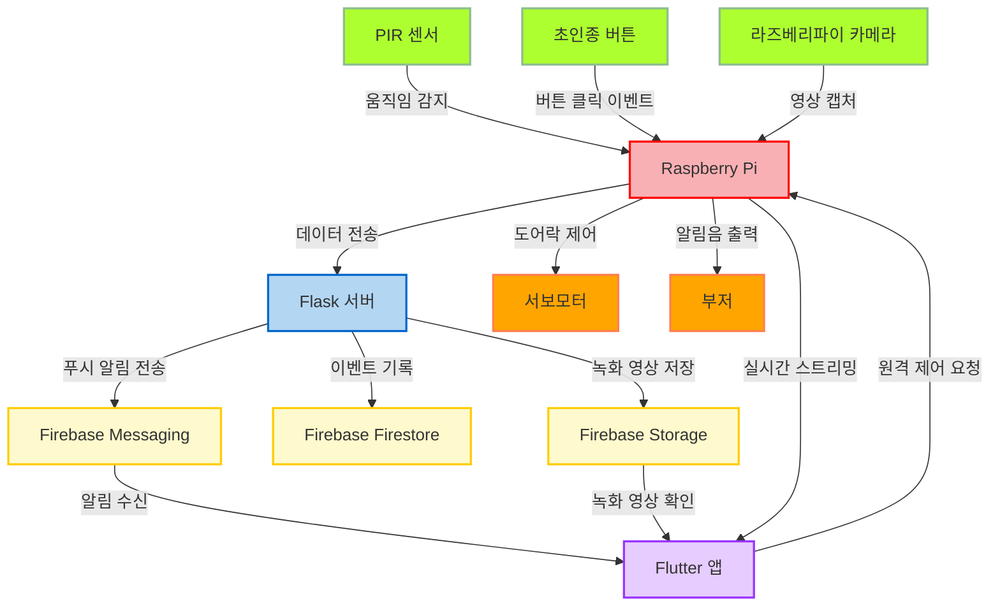

# 🔔 SDB (스마트 도어벨)
## 📖 프로젝트 소개

**스마트 도어벨 (Smart Doorbell, SDB**)은 IoT 기술을 활용하여 방문자를 감지하고, 사용자에게 알림을 보내며, 원격으로 문을 제어할 수 있는 시스템이다. Raspberry Pi와 Flutter 앱을 중심으로 설계되어, 실시간 영상 스트리밍, 양방향 음성 통화, 녹화 기능, 방문자 감지 알림 등 다양한 기능을 제공하여 사용자에게 편의성과 안전성을 제공한다.

## 💡 프로젝트 배경

**현대 가정의 보안 요구 증가**

- 1인 가구의 증가와 함께 가정 내 보안 문제 대두
- 빈집털이, 강도 사건 등 예상치 못한 위험 요소에 대한 대체 필요
- 방문자 확인 및 보안 강화를 위한 효과적인 솔루션 요구

**IoT 기술의 발전과 활용**

- 센서, 카메라, 클라우드 서비스 연동을 통한 스마트 보안 시스템 구현
- 저비용으로 다양한 장치 통합 가능
- 스마트 홈 보안 솔루션의 핵심 기술로 자리 잡은 IoT

**안전한 가정 환경 구축의 필요성**

- 움직임 감지, 실시간 영상 스트리밍, 녹화 및 알림을 통한 즉각적인 위험 대응
- SDB 프로젝트의 통합 기술로 편리함과 보안 제공

## 🎯 프로젝트 목표

**방문자 관리의 편리성 제공**

- 실시간 영상 스트리밍으로 문 앞 상황을 스마트폰에서 바로 확인
- 양방향 음성 통화를 통해 방문자와 직접 소통
- 도어락 원격 제어로 물리적 거리와 상관없이 도어락 제어 가능

**안전한 가정 보안 시스템 구현**

- PIR 센서로 움직임을 감지하고, 방문자 이벤트를 기록
- 녹화된 영상을 Firebase에 저장해 언제든지 상황 확인 가능
- 알림 시스템을 통해 위험 상황 발생 시 빠르게 대처 가능

**IoT 기술의 통합 활용**

- Raspberry Pi와 다양한 센서를 연동하여 스마트 보안 환경 제공
- Firebase를 활용해 실시간 데이터 관리와 알림 전송
- Flutter 앱과 통합해 모든 작업을 하나의 인터페이스에서 수행

**사용자 중심 설계**

- Flutter 기반 UI로 직관적이고 쉽게 사용할 수 있는 앱 제공
- 방문자 확인, 알림 관리, 원격 제어 기능을 앱에서 간단히 실행
- 확장 가능한 구조로 사용자의 요구에 따라 기능 추가 가능

### 🖥 주요 기능

<blockquote>
  동작 감지 센서 & 녹화 기능
</blockquote>
 

  
  &nbsp;&nbsp;&nbsp;&nbsp;&nbsp;&nbsp;&nbsp;&nbsp;
  
  &nbsp;&nbsp;&nbsp;&nbsp;&nbsp;&nbsp;&nbsp;&nbsp;
  
  &nbsp;&nbsp;&nbsp;&nbsp;&nbsp;&nbsp;&nbsp;&nbsp;
  

- 사람이 문 앞에 있으면 동작 감지 센서에 의해서 감지 되고 이후 녹화 진행.
- 동작 감지 센서가 작동되면 스마트폰으로 문 앞에 누가 있다고 알림을 전송.  
- 사람이 앞에 없으면 녹화가 종료 혹은 일정 시간 만큼만 녹화.  
- 녹화된 영상은 파이어베이스를 통해서 전송되고 스마트폰 앱에서 확인 가능.
 

<blockquote>
  초인종 기능
</blockquote>
 

  
  &nbsp;&nbsp;&nbsp;&nbsp;&nbsp;&nbsp;&nbsp;&nbsp;
  
  &nbsp;&nbsp;&nbsp;&nbsp;&nbsp;&nbsp;&nbsp;&nbsp;
  

- 사람이 초인종을 누르면 부저를 통해 "딩동" 소리가 남.  
- 초인종을 누르면 스마트폰으로 누가 초인종을 눌렀다고 알림을 전송 .  
 

<blockquote>
  통화 기능
</blockquote>
 

  
  &nbsp;&nbsp;&nbsp;&nbsp;&nbsp;&nbsp;&nbsp;&nbsp;
  

- 스마트폰에서 마이크 버튼을 누르면 상대방에게 말할 수 있음.  
- 상대방에 초인종 앞에 부착된 마이크를 통해서 상대방에게 말 할 수 있음.  
- 스마트폰 자체 스피커를 통해 상대방의 말을 들을 수 있음.  
- 라즈베리파이에 연결된 스피커를 통해 상대방의 말을 들을 수 있음.  
- 파이어베이스를 통해서 음성 데이터를 전송함.
 

<blockquote>
  화상 프로세스
</blockquote>
 

  

- 라즈베리파이의 카메라를 통해서 초인종 밖의 상황을 볼 수 있다.  
- 실시간 영상이 서버를 통해서 스마트폰으로 전송이 됨.
 

## ⚙️ 하드웨어

- **Raspberry Pi 4B**: 프로젝트의 중심 제어 장치
- **PIR 모션 센서**: 방문자의 동작 감지
- **초인종 버튼**: 방문자 입력 감지
- **부저**: 초인종 알림음 출력
- **서보 모터**: 도어락 원격 제어
- **라즈베리파이 카메라 모듈**: 실시간 영상 처리

## 🛠️ 기술 스택

**운영 체제 및 환경**

- **Raspberry Pi OS (Lite)**: 하드웨어 제어와 서버 운영
- **Python Virtual Environment**: 종속성 관리 및 실행 환경 제공

**프로그래밍 언어**

- **C**: 초인종 및 방문자 감지, 서보모터 및 하드웨어 제어
- **Python**: Flask 서버 구현, Firebase 연동, 녹화 및 스트리밍 제어
- **Dart (Flutter)**: 사용자 인터페이스, 실시간 스트리밍 및 도어락 제어

**백엔드**

- **Flask**: HTTP 서버, 비디오/오디오 스트리밍, 파일 업로드
- **Firebase**: Firestore(데이터 저장), Storage(녹화 파일 관리), Admin SDK(Python 통합)

## 📁 시스템 설계 및 구조

### 📊 시스템 아키텍처

## 📚 주요 라이브러리

| **라이브러리**          | **역할 및 설명**                                                |
|-------------------------|--------------------------------------------------------------|
| **WiringPi**            | Raspberry Pi GPIO 핀 제어                                     |
| **Pthread**             | 하드웨어 이벤트를 병렬 처리하여 실시간 성능 최적화             |
| **Picamera2**           | Raspberry Pi 카메라 모듈로 비디오 프레임 캡처 및 스트리밍      |
| **OpenCV**              | 실시간 비디오 프레임 처리 및 JPEG 형식 변환                   |
| **FFmpeg**              | h264 형식의 녹화 영상을 mp4로 변환                            |
| **PyAudio**             | 오디오 데이터 캡처 및 양방향 오디오 스트리밍 처리              |
| **Flask**               | HTTP 서버로 비디오 스트리밍, 오디오 송수신, 파일 업로드 관리    |
| **Firebase Admin SDK**  | 이벤트 데이터와 영상 파일 저장 및 연동                         |
| **http (Flutter)**      | Flask 서버와의 데이터 요청 및 응답 처리                       |
| **firebase_messaging**  | Firebase를 통해 푸시 알림 수신 및 관리                        |
| **just_audio**          | Flutter 앱에서 오디오 스트리밍 데이터를 재생                  |

## ⌨ 구현 내용

## 👨🏻‍💻 팀원 소개
| Profile | Role | Part |
| ------- | ---- | ---- |
| 
<a href="https://github.com/jsy0605" width="70px;" alt=""/> <b>정성윤</b></a>
 | 팀장 | - 프로젝트 리더 - 프로세스 일정 및 전반적인 관리 - 라즈베리파이 통화 프로세스 구축 - 카메라 연결 및 하드웨어 연결  - 화상 프로세스 구축|
| 
<a href="https://github.com/dsky03" width="70px;" alt=""/> <b>김동천</b></a>
 | 팀원 | - 메인 스레드 구축 - 프로세스 연결 담당 - 초인종, 동작 감지 센서 등 하드웨어 시스템 관리 |
| 
<a href="https://github.com/son0307"> <b>손민우</b></a>
 | 팀원 | - 데이터 송수신 관리 - 파이어베스 서버 구축 및 소켓 연결  - 스마트폰 통화 프로세스 구축 - 화상 프로세스 구축| 
| 
<a href="https://github.com/choongmoo"> <b>허충무</b></a>
 | 팀원 | - 녹화 시스템 개발 - 녹화 파일 저장 및 전송 시스템 구축|

## 🔍 결론 및 향후 개선 방향
- 프로젝트 성과 요약
- 향후 개선 및 기능 확장 가능성
