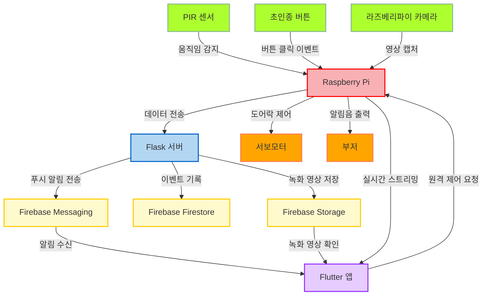

# 임베디드시스템 프로젝트 - SDB

## 📖 프로젝트 소개

<p align="center">
  
</p>

**스마트 도어벨 (Smart Doorbell, SDB**)은 IoT 기술을 활용하여 방문자를 감지하고, 사용자에게 알림을 보내며, 원격으로 문을 제어할 수 있는 시스템이다. Raspberry Pi와 Flutter 앱을 중심으로 설계되어, 실시간 영상 스트리밍, 양방향 음성 통화, 녹화 기능, 방문자 감지 알림 등 다양한 기능을 제공하여 사용자에게 편의성과 안전성을 제공한다.

<br/>

<br/>

## 💡 프로젝트 배경

<p align="center">
  
</p>

**현대 가정의 보안 요구 증가**

- 1인 가구의 증가와 함께 가정 내 보안 문제 대두
- 빈집털이, 강도 사건 등 예상치 못한 위험 요소에 대한 대체 필요
- 방문자 확인 및 보안 강화를 위한 효과적인 솔루션 요구

**IoT 기술의 발전과 활용**

- 센서, 카메라, 클라우드 서비스 연동을 통한 스마트 보안 시스템 구현
- 저비용으로 다양한 장치 통합 가능
- 스마트 홈 보안 솔루션의 핵심 기술로 자리 잡은 IoT

**안전한 가정 환경 구축의 필요성**

- 움직임 감지, 실시간 영상 스트리밍, 녹화 및 알림을 통한 즉각적인 위험 대응
- SDB 프로젝트의 통합 기술로 편리함과 보안 제공


<br/>

## 🎯 프로젝트 목표

**방문자 관리의 편리성 제공**

- 실시간 영상 스트리밍으로 문 앞 상황을 스마트폰에서 바로 확인
- 양방향 음성 통화를 통해 방문자와 직접 소통
- 도어락 원격 제어로 물리적 거리와 상관없이 도어락 제어 가능

**안전한 가정 보안 시스템 구현**

- 방문자의 움직임을 감지하고, 움직임 감지 이벤트 발생을 기록
- 녹화된 영상을 서버에 저장해 언제든지 상황 확인 가능
- 알림 시스템을 통해 위험 상황 발생 시 빠르게 대처 가능

**IoT 기술의 통합 활용**

- Raspberry Pi와 다양한 센서를 연동하여 스마트 보안 환경 제공
- 클라우드 서비스를 활용해 실시간 데이터 관리와 알림 전송
- 스마트폰 앱을 통해 시스템 전체를 원격으로 제어하고 모니터링 가능


<br/>

## ⚙️ 하드웨어
| **이미지**         | **하드웨어 이름**       | **역할**                                          |
|--------------------|-------------------------|---------------------------------------------------|
|  | **Raspberry Pi 4B**    | 프로젝트의 중심 제어 장치                          |
|  | **PIR 모션 센서**       | 방문자의 동작 감지                                |
|  | **초인종 버튼**         | 방문자 입력 감지                                  |
|  | **부저**               | 초인종 알림음 출력                                |
|  | **서보 모터**           | 도어락 원격 제어                                  |
|  | **라즈베리파이 카메라 모듈** | 실시간 영상 처리                                  |


<br/>

## 🛠️ 기술 스택

**운영 체제 및 환경**

- **Raspberry Pi OS (Lite)**: 하드웨어 제어와 서버 운영
- **Python Virtual Environment**: 종속성 관리 및 실행 환경 제공

**프로그래밍 언어**

- **C**: 초인종 및 방문자 감지, 서보모터 및 하드웨어 제어
- **Python**: Flask 서버 구현, Firebase 연동, 녹화 및 스트리밍 제어
- **Dart (Flutter)**: 사용자 인터페이스, 실시간 스트리밍 및 도어락 제어

**백엔드**

- **Flask**: HTTP 서버, 비디오/오디오 스트리밍, 파일 업로드
- **Firebase**: Cloud Messaging(알람 전송), Storage(녹화 파일 관리), Admin SDK(Python, Flutter 통합)

<br/>


## 📊 시스템 아키텍처




<br/>

## 💻 멀티 프로세스 & 멀티 스레드

### 멀티 프로세스 🔗

| **프로세스 이름**         | **생성 위치**           | **주요 역할**                                                             |
|---------------------------|------------------------|----------------------------------------------------------------------------|
| **Main Process**          | `motion_detection.c`  | PIR 센서 및 초인종 버튼 감지, Flask 및 Motor 프로세스 생성, 이벤트 트리거  |
| **Flask Process**         | `flask_app.py`        | Flask 서버 실행, 비디오/오디오 스트리밍 제공, HTTP 요청 처리, 녹화 관리    |
| **Recording Controller**  | `flask_app.py` 내부   | `control.txt` 모니터링, 녹화 상태 관리, Firebase 업로드 처리               |
| **Motor Process**         | `motor.c`             | Flask Process와 소켓 통신 대기, 명령 수신 후 서보모터 제어                 |

### 프로세스 간 데이터 전달 방식 📂

**📂 공유 자원을 통한 상태 관리**

- 프로세스 간 상태 정보를 기록하고 읽는 방식으로 동기화 수행
- 움직임 감지 상태, 스트리밍 상태를 기록

**📝 상태 전송 사례와 각 프로세스에서의 활용 방식**

1. **움직임 감지 시 → 움직임 감지 "활성" 상태 기록**
    - **움직임 감지 프로세스**: PIR 센서를 통해 움직임이 감지되면 **움직임 감지 상태**에 "활성" 상태를 기록
    - **녹화 프로세스**: **움직임 감지 상태**을 주기적으로 확인하며, "활성" 상태가 감지되면 녹화를 시작
      - 만약 **스트리밍 상태가 "활성**"인 경우, 움직임 감지 상태와 관계없이 녹화를 수행하지 않음.
2. **움직임 종료 시 → 움직임 감지 "비활성" 상태 기록**
    - **움직임 감지 프로세스**: PIR 센서가 일정 시간 움직임을 감지하지 못하면 **움직임 감지 상태**에 "비활성" 상태를 기록
    - **녹화 프로세스**: **움직임 감지 상태**이 "비활성" 상태로 변경되면 녹화를 종료
3. **스트리밍 활성화 시 → 스트리밍 "활성" 상태 기록**
    - **스트리밍 프로세스**: 스트리밍 요청이 들어오면 **스트리밍 상태**에 "활성" 상태를 기록
    - **녹화 프로세스**: **스트리밍 상태**을 주기적으로 확인하며, "활성" 상태가 감지되면 녹화를 중지
    - **움직임 감지 프로세스**: **스트리밍 상태**을 참조하여, 스트리밍이 활성 상태인지 확인하며 작업 수행
4. **스트리밍 중지 시 → 스트리밍 "비활성" 상태 기록**
    - **스트리밍 프로세스**: 스트리밍 중지 요청이 들어오면 **스트리밍 상태**에 "비활성" 상태를 기록
    - **움직임 감지 프로세스**: **스트리밍 상태**을 확인하여, "비활성" 상태로 작업을 종료

**💡 공유 자원의 장점**

- 간단하고 가벼운 방식으로 프로세스 간 데이터 동기화 가능
- 다른 언어를 사용하는 프로세스 간 데이터 공유가 간편
- 강한 결합을 피하고 확장 가능한 구조 제공
  
### 멀티 스레드 🔗

- **Main Process (`motion_detection.c`)**

| **스레드 이름**           | **주요 역할**                                                               |
|--------------------------|----------------------------------------------------------------------------|
| **Motion Detection Thread** | PIR 센서를 통해 움직임 감지, Flask 서버 실행                                 |
| **Button Press Thread**     | 초인종 버튼 입력 감지, Firebase 알림 전송, 후속 작업 트리거                   |
| **Buzzer Thread**           | 초인종 버튼 입력 발생 시 부저를 울려 사용자 알림 제공                        |

- **Flask Process (`flask_app.py`)**
  
| **스레드 이름**             | **주요 역할**                                                |
|----------------------------|-------------------------------------------------------------|
| **Flask Request Threads**    | HTTP 요청 처리, `/stream`, `/audio`, `/upload` 등 각 요청별로 스레드 생성 |
| **Recording Thread**         | Picamera2로 비디오 스트리밍 처리                           |
| **Audio Streaming Thread**   | PyAudio로 실시간 오디오 데이터 스트리밍                    |
| **Audio Playback Thread**    | 업로드된 오디오 파일 재생                                  |
| **Cleanup Thread**           | 애플리케이션 종료 시 카메라 및 오디오 리소스 정리           |

- **Motor Process (`motor.c`)**

| **스레드 이름**           | **주요 역할**                                                               |
|--------------------------|----------------------------------------------------------------------------|
| **Socket Thread**        | 클라이언트로부터 명령 수신, 작업 큐에 저장                                    |
| **Output Thread**        | 작업 큐에서 명령을 읽어 서보모터 각도 제어                                    |


<br/>

## 📚 주요 라이브러리

| **라이브러리**          | **역할 및 설명**                                                |
|-------------------------|--------------------------------------------------------------|
| **WiringPi**            | Raspberry Pi GPIO 핀 제어                                     |
| **Pthread**             | 하드웨어 이벤트를 병렬 처리하여 실시간 성능 최적화             |
| **Picamera2**           | Raspberry Pi 카메라 모듈로 비디오 프레임 캡처 및 스트리밍      |
| **OpenCV**              | 실시간 비디오 프레임 처리 및 JPEG 형식 변환                   |
| **FFmpeg**              | h264 형식의 녹화 영상을 mp4로 변환                            |
| **PyAudio, Pygame**     | 오디오 데이터 캡처 및 양방향 오디오 스트리밍 처리              |
| **Flask**               | HTTP 서버로 비디오 스트리밍, 오디오 송수신, 파일 업로드 관리    |
| **Firebase Admin SDK**  | 이벤트 데이터와 영상 파일 저장 및 연동                         |
| **http (Flutter)**      | Flask 서버와의 데이터 요청 및 응답 처리                       |
| **firebase_messaging**  | Firebase를 통해 푸시 알림 수신 및 관리                        |
| **just_audio**          | Flutter 앱에서 오디오 스트리밍 데이터를 재생                  |


<br/>

## ⌨️ 시스템 구현

### 1. **움직임 감지 및 녹화 제어**

**주요 역할**

- PIR 센서를 통해 움직임을 감지하고, 감지 상태 파일을 통해 **녹화 프로세스**와 상태를 동기화
- 움직임 감지 시 비디오를 녹화하고, 녹화된 파일을 `.mp4`로 변환한 후 Firebase에 업로드

**동작 방식**

1. **움직임 감지**
    - PIR 센서가 움직임을 감지하면 **감지 상태 파일**에 "활성" 상태를 기록
    - 움직임이 8초간 감지되지 않을 경우 "비활성" 상태로 초기화
2. **녹화 시작 및 종료**
    - Flask 프로세스가 **감지 상태 파일**을 주기적으로 읽어 상태를 확인
    - "활성" 상태일 경우 녹화를 시작하고, "비활성" 상태로 전환되면 녹화를 종료
3. **Firebase 업로드**
    - 녹화 종료 후 `.h264` 파일을 `.mp4`로 변환
    - 변환된 `.mp4` 파일을 Firebase Storage에 업로드

**핵심 코드**

- **움직임 감지 (`Motion_Detection.c`)**:
  
  ```c
  void *motionDetectionThread(void *arg) {
      int motionDetected = 0;
      unsigned long lastMotionTime = 0;
  
      while (1) {
          motionDetected = digitalRead(PIR_PIN);
          if (motionDetected) {
              lastMotionTime = millis();
              if (!personDetected) {
                  personRecognition = 1;
                  personDetected = 1;
                  writeSignalToFile("1"); // "활성" 상태 기록
                  uploadToFirebase_Sensor();
              }
          } else if (!motionDetected && (millis() - lastMotionTime > 8000) && personRecognition) {
              personRecognition = 0;
              personDetected = 0;
              writeSignalToFile("0"); // "비활성" 상태 기록
          }
          delay(200);
      }
  }
  
  ```

- **녹화 및 Firebase 업로드 (`flask_app.py`)**:

  ```python
  def start_recording():
      timestamp = time.strftime("%Y%m%d_%H%M%S")
      video_path = os.path.join(video_dir, f"{timestamp}.h264")
      print("녹화 시작...")
      command = ["libcamera-vid", "-t", "0", "-o", video_path]
      process = subprocess.Popen(command)
      return process, video_path
  
  def convert_to_mp4(video_path):
      convert_command = [
          "ffmpeg",
          "-i", video_path,
          "-c:v", "copy",
          video_path.replace(".h264", ".mp4")
      ]
      print("MP4 변환 중...")
      subprocess.run(convert_command)
      print("MP4 변환 완료")
  
  def upload_to_firebase(video_path):
      firebase_video_upload.upload_file_to_firebase(
          video_path, "videos/" + os.path.basename(video_path)
      )
  
  def recording_controller():
      while True:
          with open(file_path, "r") as f:
              state = f.read().strip()
  
          if state == "1":  # 활성 상태
              if not recording_process:
                  recording_process, current_video_path = start_recording()
  
          elif state == "0":  # 비활성 상태
              if recording_process:
                  recording_process.terminate()
                  recording_process = None
                  if current_video_path:
                      convert_to_mp4(current_video_path)
                      upload_to_firebase(current_video_path.replace(".h264", ".mp4"))
          time.sleep(0.1)
  
  ```

<p> </p>

### 2. **영상 스트리밍**

**주요 역할**

- **스트리밍 활성화**: `/stream` 요청 시 비디오 스트림 활성화
- **스트리밍 중지**: `/stop_stream` 요청 시 비디오 스트림 중지

**동작 방식**

1. **스트리밍 활성화**
    - **스트리밍 상태 변수**(`streaming_video.value`)를 "활성"으로 설정.
    - 카메라 초기화 및 프레임 생성 시작.
2. **스트리밍 중지**
    - 상태 변수를 "비활성"으로 설정하고, 카메라 리소스를 해제.

**핵심 코드**

- **스트리밍 활성화 및 중지 (`flask_app.py`)**:

  ```python
  @app.route('/stream')
  def stream():
      with lock:
          if not streaming_video.value:
              initialize_camera()
              streaming_video.value = True
      return Response(generate_frames(), mimetype='multipart/x-mixed-replace; boundary=frame')
  
  @app.route('/stop_stream')
  def stop_stream():
      with lock:
          streaming_video.value = False
          release_camera()
      return "스트리밍 중지"
  ```

### **3. 음성 입력 및 송신 (라즈베리파이 → 스마트폰)**

**주요 역할**

- 라즈베리파이 마이크로 입력된 음성을 실시간으로 캡처하고 Flask 서버를 통해 스마트폰으로 전송

**동작 방식**

1. **오디오 캡처**
    - `PyAudio`를 사용하여 라즈베리파이의 마이크 입력을 캡처
2. **실시간 스트리밍**
    - Flask 서버의 `/audio` 엔드포인트를 통해 스마트폰으로 오디오 데이터를 전송

**핵심 코드**

- **오디오 스트리밍 (`flask_app.py`)**:

  ```python
  def audio_stream():
      CHUNK = 256
      stream = audio1.open(format=FORMAT, channels=CHANNELS, input_device_index=2,
                           rate=RATE, input=True, frames_per_buffer=CHUNK)
      print("오디오 스트리밍 시작")
      while is_streaming:
          data = stream.read(CHUNK, exception_on_overflow=False)
          yield data
      stream.stop_stream()
      stream.close()
  
  @app.route('/audio')
  def audio():
      global is_streaming
      is_streaming = True
      return Response(audio_stream(), mimetype="audio/wav")
  ```

### **4. 음성 수신 및 출력 (스마트폰 → 라즈베리파이)**

**주요 역할**

- 스마트폰에서 전송된 오디오 데이터를 라즈베리파이에서 수신하여 스피커로 출력

**동작 방식**

1. **오디오 업로드**
    - 스마트폰에서 녹음된 파일을 `/upload` 엔드포인트로 전송
2. **오디오 재생**
    - 업로드된 파일을 `Pygame`을 이용하여 라즈베리파이의 스피커로 출력

**핵심 코드**

- **오디오 파일 업로드 (`flask_app.py`)**:

  ```python
  @app.route('/upload', methods=['POST'])
  def upload_audio():
      if 'file' not in request.files:
          return "No file part", 400
      file = request.files['file']
      if file.filename == '':
          return "No selected file", 400
      path = os.path.join(audio_path, file.filename)
      file.save(path)
      threading.Thread(target=play_audio, args=(path,)).start()
      return f"File saved at {path}", 200
  
  def play_audio(audio_path):
      print("오디오 재생 중...")
      pygame.mixer.init()
      pygame.mixer.music.load(audio_path)
      pygame.mixer.music.play()
      while pygame.mixer.music.get_busy():
          continue
      pygame.mixer.music.stop()
      pygame.mixer.quit()
  ```

### 5. **서보모터를 통한 도어락 제어**

**주요 역할**

- 원격 도어락 제어를 위한 서보모터 명령 처리
- 소켓 서버를 통해 명령 수신 및 서보모터 회전

**동작 방식**

1. **명령 수신**
    - 소켓 서버에서 명령을 수신하여 작업 큐에 저장
2. **명령 실행**
    - 작업 큐에서 명령을 읽어 서보모터 회전 각도 설정

**핵심 코드**

- **서보모터 제어 (`motor.c`)**:

  ```c
  void *outputThread(void *arg) {
      while (1) {
          if (!queueIsEmpty()) {
              char *command = dequeue();
              if (strcmp(command, "LOCK") == 0) {
                  setServoAngle(0); // 도어락 잠금
              } else if (strcmp(command, "UNLOCK") == 0) {
                  setServoAngle(90); // 도어락 해제
              }
              free(command);
          }
          usleep(50000);
      }
  }
  ```

### 6. **알림 및 데이터 업로드**

**주요 역할**

- Firebase를 통해 움직임 감지 알림 및 녹화 영상을 클라우드에 업로드

**동작 방식**

1. **움직임 감지 알림**
    - PIR 센서에서 움직임 감지 시 Firebase API를 호출하여 알림 전송
2. **녹화 영상 업로드**
    - `.mp4`로 변환된 동영상 파일을 Firebase Storage에 업로드

핵심 코드

- **움직임 감지 알림 (`Motion_Detection.c`)**:

  ```c
  void uploadToFirebase_Sensor() {
      system("python3 /home/pi/SDB/firebaseUpload_Sensor.py");
  }
  ```

- **녹화 영상 업로드 (`flask_app.py`)**:

  ```python
  def upload_to_firebase(video_path):
      firebase_video_upload.upload_file_to_firebase(
          video_path, "videos/" + os.path.basename(video_path)
      )
  ```

<br/>

## 📱 **앱 구현**

Flutter로 개발된 스마트 도어벨 앱은 라즈베리파이와의 실시간 통신을 통해 영상 스트리밍, 음성 송수신, 도어락 제어 및 녹화 관리 기능을 제공한다. 사용자는 직관적인 UI를 통해 간편하게 스마트 도어벨의 다양한 기능을 활용할 수 있다.

### **앱의 주요 기능**

Flutter로 개발된 앱은 다음의 주요 기능을 제공합니다:

- **IP 입력 및 저장**: 사용자가 라즈베리파이의 IP 주소를 입력하고 저장
- **영상 스트리밍**: 실시간으로 라즈베리파이에서 스트리밍되는 영상을 표시
- **음성 송신 및 수신**: 사용자 음성을 라즈베리파이에 전송하거나 라즈베리파이의 마이크 입력을 실시간으로 청취
- **도어락 제어**: 버튼을 통해 원격으로 도어락을 잠그거나 해제
- **녹화 목록 관리**: Firebase Storage에서 녹화된 영상 목록을 가져와 재생

### **1. 앱의 구조**

- **`IpInputScreen`**: 메인 화면으로, IP 입력, 영상 스트리밍, 음성 송신/수신, 도어락 제어를 제공
- **`VideoListScreen`**: Firebase Storage에 저장된 녹화 영상 목록을 표시
- **`VideoPlayerScreen`**: 선택된 영상을 재생

### **2. IP 입력 및 저장**

사용자가 라즈베리파이의 IP 주소를 입력하여 앱의 모든 기능이 해당 IP를 기반으로 동작하도록 설정

**핵심 코드**:

  ```dart
  dart
  코드 복사
  void _saveIp() {
    setState(() {
      _savedIp = _ipController.text;
    });
    ScaffoldMessenger.of(context).showSnackBar(
      SnackBar(content: Text("IP 주소가 저장되었습니다: $_savedIp")),
    );
  }
  
  ```

### 3. **영상 스트리밍**

사용자가 **카메라 버튼**을 누르면 라즈베리파이에서 영상 스트리밍을 시작하거나 중지

**핵심 코드**:

  ```dart
  dart
  코드 복사
  void _toggleWebcam() {
    if (_savedIp.isEmpty) {
      ScaffoldMessenger.of(context).showSnackBar(
        SnackBar(content: Text("먼저 IP 주소를 저장해주세요.")),
      );
      return;
    }
  
    setState(() {
      if (!_showWebcam) {
        _showWebcam = true;
        _webViewController.loadRequest(
            Uri.parse('http://$_savedIp:5000/stream'));
      } else {
        _showWebcam = false;
        _webViewController.loadRequest(
            Uri.parse('http://$_savedIp:5000/stop_stream'));
      }
    });
  }
  
  ```

### 4. **음성 송신 (앱 → 라즈베리파이)**

사용자가 **마이크 버튼**을 누르고 있는 동안 음성을 녹음하여 라즈베리파이에 전송

**핵심 코드**:

  ```dart
  dart
  코드 복사
  GestureDetector(
    onLongPressStart: (details) {
      setState(() {
        isRecordPressed = true;
      });
      startRecording();
    },
    onLongPressEnd: (details) async {
      setState(() {
        isRecordPressed = false;
      });
      await stopRecording();
      await uploadAudio();
    },
    child: ElevatedButton(
      onPressed: () {},
      style: ElevatedButton.styleFrom(
        backgroundColor: isRecordPressed ? Colors.blue : Colors.white,
        shape: CircleBorder(),
        padding: const EdgeInsets.all(20),
      ),
      child: Icon(
        Icons.mic,
        color: isRecordPressed ? Colors.white : Colors.blue,
        size: 30,
      ),
    ),
  ),
  ```

### 5. **음성 수신 (라즈베리파이 → 앱)**

사용자가 **볼륨 버튼**을 눌러 라즈베리파이의 마이크 입력을 실시간으로 출력

**핵심 코드**:

  ```dart
  Future<void> _startStreaming() async {
    if (_savedIp.isEmpty) {
      ScaffoldMessenger.of(context).showSnackBar(
        SnackBar(content: Text("먼저 IP 주소를 저장해주세요.")),
      );
      return;
    }
  
    final String audioUrl = "http://$_savedIp:5000/audio";
    try {
      await _audioPlayer.stop();
      await _audioPlayer.setUrl(audioUrl);
      _audioPlayer.play();
      setState(() {
        _isPlaying = true;
      });
    } catch (e) {
      print("Error starting audio stream: $e");
    }
  }
  ```


### 6. **도어락 제어**

사용자가 **도어락 버튼**을 누르면 라즈베리파이에 신호를 전송하여 도어락을 잠그거나 해제 신호 전달

**핵심 코드**:

```dart
Future<void> _sendRequest() async {
  if (_savedIp.isEmpty) {
    ScaffoldMessenger.of(context).showSnackBar(
      SnackBar(content: Text("먼저 IP 주소를 저장해주세요.")),
    );
    return;
  }

  final url = Uri.parse("http://$_savedIp:5000/trigger");
  try {
    final response = await http.get(url);
    ScaffoldMessenger.of(context).showSnackBar(
      SnackBar(content: Text("요청이 성공적으로 전송되었습니다.")),
    );
  } catch (e) {
    ScaffoldMessenger.of(context).showSnackBar(
      SnackBar(content: Text("요청 실패: $e")),
    );
  }
}
```

### 7. **녹화 목록 관리**

Firebase Storage에서 녹화된 영상 목록을 가져와 사용자에게 표시하며, 사용자는 원하는 영상을 선택하여 재생할 수 있습니다.

**Firebase Storage에서 녹화 목록 가져오기**:

```dart
Future<void> _fetchVideoList() async {
  try {
    final ref = FirebaseStorage.instance.ref('videos');
    final result = await ref.listAll();

    final videoInfo = await Future.wait(
      result.items.map((fileRef) async {
        final metadata = await fileRef.getMetadata();
        final url = await fileRef.getDownloadURL();
        final createdTime = metadata.timeCreated ?? DateTime.now();
        final formattedTime = '${createdTime.year}-${createdTime.month.toString().padLeft(2, '0')}-${createdTime.day.toString().padLeft(2, '0')} ${createdTime.hour.toString().padLeft(2, '0')}:${createdTime.minute.toString().padLeft(2, '0')}';

        return {'url': url, 'name': formattedTime};
      }).toList(),
    );

    setState(() {
      videoData = videoInfo;
      isLoading = false;
    });
  } catch (e) {
    print('Error fetching video list: $e');
    setState(() {
      isLoading = false;
    });
  }
}
```

**비디오 재생**:

```dart
lass VideoPlayerScreen extends StatefulWidget {
  final String videoUrl;

  const VideoPlayerScreen({required this.videoUrl});

  @override
  _VideoPlayerScreenState createState() => _VideoPlayerScreenState();
}

class _VideoPlayerScreenState extends State<VideoPlayerScreen> {
  late VideoPlayerController _controller;

  @override
  void initState() {
    super.initState();
    _controller = VideoPlayerController.network(widget.videoUrl)
      ..initialize().then((_) {
        setState(() {});
        _controller.play();
      });
  }

  @override
  Widget build(BuildContext context) {
    return Scaffold(
      appBar: AppBar(
        title: Text('Play Video'),
      ),
      body: Center(
        child: _controller.value.isInitialized
            ? AspectRatio(
                aspectRatio: _controller.value.aspectRatio,
                child: VideoPlayer(_controller),
              )
            : CircularProgressIndicator(),
      ),
    );
  }

  @override
  void dispose() {
    _controller.dispose();
    super.dispose();
  }
}
```
<br/>

## 🖥 기능 시연

<blockquote>
  동작 감지 센서 & 녹화 기능
</blockquote>

<p align="center">
  
  &nbsp;&nbsp;&nbsp;&nbsp;&nbsp;&nbsp;&nbsp;&nbsp;&nbsp;&nbsp;&nbsp;&nbsp;&nbsp;&nbsp;&nbsp;&nbsp;
  
</p>
<br />

- 방문자의 움직임 감지 시 자동으로 녹화 시작
- 일정 시간 동안 감지되면 스마트폰으로 문 앞에 누가 있다고 알림 전송
- 녹화된 영상은 스마트폰 앱에서 확인 가능

<br />
<blockquote>
  초인종 기능
</blockquote>
  
<p align="center">
  
</p>
<br />

- 초인종 버튼 누를 시 부저를 통해 "딩동" 소리가 남
- 스마트폰으로 누군가가 초인종을 눌렀다고 알림 전송

<br />
<blockquote>
  화상 통화 기능
</blockquote>

<p align="center">
  
</p>
<br />

통화 영상을 보려면 [통화](https://youtube.com/shorts/61aT8ZT9RZU?feature=share) 클릭
<br />

- 초인종의 카메라로 바깥 상황을 실시간으로 앱에서 확인
- 스마트폰 앱에서 음성 및 영상 통화 실행
- 초인종 마이크로 음성 전달, 스마트폰 스피커로 출력
- 스마트폰 마이크로 음성 전달, 초인종 스피커로 출력

<br />

## 👨🏻‍💻 팀원 소개 및 역할 분담
| Profile | Role | Part |
| ------- | ---- | ---- |
| <div align="center"><a href="https://github.com/jsy0605" width="70px;" alt=""/><br/><sub><b>정성윤</b><sub></a></div> | 팀장 | - 프로젝트 리더<br/>- 프로세스 일정 및 전반적인 관리<br/>- 라즈베리파이 통화 프로세스 구축<br/>- 카메라 연결 및 하드웨어 연결 <br/>- 화상 프로세스 구축|
| <div align="center"><a href="https://github.com/dsky03" width="70px;" alt=""/><br/><sub><b>김동천</b></sub></a></div> | 팀원 | - 메인 스레드 구축<br/>- 프로세스 연결 담당<br/>- 초인종, 동작 감지 센서 등 하드웨어 시스템 관리 |
| <div align="center"><a href="https://github.com/son0307"><br/><sub><b>손민우</b></sub></a></div> | 팀원 | - 데이터 송수신 관리<br/>- firebase 서버 구축 및 소켓 연결 <br/>- 스마트폰 통화 프로세스 구축<br/>- 화상 프로세스 구축<br/>- flutter 앱 개발| 
| <div align="center"><a href="https://github.com/choongmoo"><br/><sub><b>허충무</b></sub></a></div> | 팀원 | - 녹화 시스템 개발<br/>- 녹화 파일 저장 및 전송 시스템 구축|


<br/>

## 🔍 결론 및 향후 개선 방향

### **프로젝트 성과 요약**

- **실시간 음성 및 영상 전송**: Raspberry Pi와 앱 간의 실시간 음성 전달 및 스트리밍 기능 구현 성공
- **움직임 기반 녹화**: PIR 센서를 통한 움직임 감지 및 녹화, Firebase Storage로 녹화 영상 업로드 시스템 구축
- **장치 간 충돌 문제 해결**: 오디오, 카메라 모듈 등 장치 간 간섭 문제를 소프트웨어 및 하드웨어적으로 해결

### **해결된 주요 문제 및 방안**

**실시간 음성 전달 간 오류 발생**
- **문제**: 음성 처리 속도가 음성 파일 생성 속도를 따라가지 못해 스마트폰에서의 WAV 파일 전달 간 큐 오버플로우 발생
- **해결 방안**: 앱에서 "눌러서 말하기" 기능 도입으로 음성 파일 생성과 전송 간의 비동기 처리를 개선
  
**오디오 장치 설정 간 문제 발생**
- **문제**: 기본 오디오 입력 및 출력 장치 간의 충돌
- **해결 방안**:
  - ALSA에서 기본 장치 설정 변경 (`/etc/asound.conf`)
  - Pygame은 기본 장치로 3.5mm 스피커 사용, PyAudio는 카드 번호로 마이크 장치 지정
    
**앱에서 전송한 음성 재생 불가 문제**
- **문제**: 녹음, 전송, 저장 성공 후 Pygame에서 재생 오류 발생
- **해결 방안**: 앱의 음성 코덱(Coder)과 Raspberry Pi 재생 코덱(Decoder)을 일치시켜 오류 제거
  
**카메라 관련 코드 통합 간 충돌**
- **문제**: 스트리밍(Picamera2)과 녹화(Libcamera-Vid) 동시 처리 시 하드웨어 성능 문제로 프레임 저하 발생
- **해결 방안**:
  - Lock을 사용해 카메라 모듈 충돌 방지
  - 스트리밍: 로딩 속도가 빠른 Picamera2 사용
  - 녹화: 안정적인 Libcamera-Vid 사용
    
**PIR 센서 민감도 문제**
- **문제**: PIR 센서의 High 신호 전달 시간이 길어 불규칙적 동작 발생
- **해결 방안**:
  - 가변 저항이 달린 PIR 센서로 교체
  - 하드웨어적으로 햇빛 차단 및 측정 범위 제한
  - 소프트웨어적으로 LOW 상태에서도 녹화 지속되도록 조정
  
**3.5mm 오디오 간섭 문제**
- **문제**: GPIO 핀 간섭으로 인해 스피커에서 비정상적인 소음 발생
- **해결 방안**: 서보모터의 GPIO 핀을 18, 19에서 13번으로 변경하고 SoftPWM 방식으로 간섭 제거

### **향후 개선 및 기능 확장 가능성**

1. **얼굴 인식을 통한 사용자 알림**
    - OpenCV나 YOLO와 같은 얼굴 인식 기술을 활용해 방문자를 등록 및 식별.
    - 얼굴 등록을 통해 "[방문자 1]님이 도착하였습니다."와 같은 맞춤형 알림 제공.
    - 보안 수준을 높이고, 가족 및 친구와 같은 자주 방문하는 사람들에게 편리함 제공.
2. **음성 품질 향상**
    - 소음 제거 및 필터링 기술을 활용한 음성 품질 개선 (예: WebRTC, Noise Suppression)
    - 마이크와 스피커 간 간섭 최소화를 위한 하드웨어 및 소프트웨어 최적화
    - 더 자연스러운 양방향 음성 통신 지원
3. **상시 음성 전달 구현**
    - 스마트폰 앱에서 청크 단위로 음성 파일 전달하는 기능 구현했으나 오버플로우 발생
    - 필터링 기술을 통한 파일 전송 최소화로 열린 마이크 기능 구현
4. **사용자 편의성 증대**
    - 앱 UI 개선: 사용자 경험을 중심으로 직관적인 디자인으로 리뉴얼
    - 알림 커스터마이징 기능 추가: 사용자가 알림 톤, 진동 패턴 등을 선택할 수 있도록 설정 메뉴 제공
    - 방문자 기록 확인 기능 추가: 방문자 히스토리를 날짜별로 확인 가능
5. **보안 강화**
    - 동영상 데이터의 암호화 및 클라우드 저장 시 보안 강화
    - 앱과 라즈베리파이 간 통신의 HTTPS 적용으로 데이터 전송 중 보안 확보
    - 알림에 이중 인증 기능 추가로 사용자의 정보 보호
